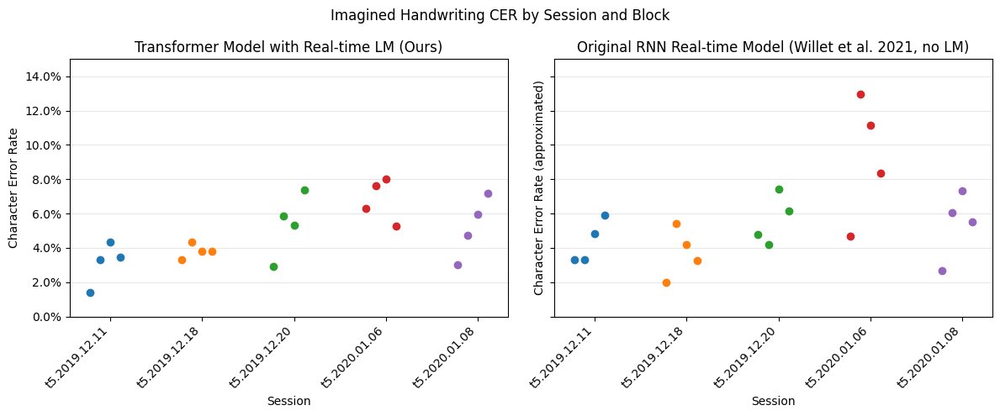

<p align="center">
  
</p>

# Imagined Handwriting 
In 2021, Willett et al. released a groundbreaking study entitled "High-performance brain-to-text communication via handwriting" that demonstrated outstanding decoding of imagined handwriting. This repository contains the efforts at [AE Studio](https://ae.studio/neurotechnology-consulting) to reproduce the original results and explore modifications to the original methods. We found that the original study's results were highly robust and reproducible. We are publicly releasing our investigation and code to assist others in the field who wish to explore and extend this groundbreaking research.

The `gif` above shows a demo of our alternative implementation of the imagined handwriting decoder running in **real time**. On the right, we show a raster plot of the spike rates going into the decoder, and on the left, the decoded sentence.

## Acknowledgements
This work is based entirely on the seminal paper
> Willett, F.R., Avansino, D.T., Hochberg, L.R. et al. High-performance brain-to-text communication via handwriting. Nature 593, 249–254 (2021).
>
>https://doi.org/10.1038/s41586-021-03506-2

and the data and code that was released with the paper.

### Links
* [High-performance brain-to-text communication via handwriting](https://www.nature.com/articles/s41586-021-03506-2)
* [Supplementary Information](https://www.nature.com/articles/s41586-021-03506-2#Sec10)
* [Data](https://doi.org/10.5061/dryad.wh70rxwmv)
* [Original Code Release](https://github.com/fwillett/handwritingBCI)

## Overview
This is an open-source release of an alternative implementation for an imagined handwriting decoder.
It includes the following modifications from the original paper and code release.

1. Replace the RNN model with a FNet transformer model.
1. Add a simple but effective real-time beam search that includes a dictionary constraint and a language model.
1. Add streaming data augmentation so that +100Gb of augmentation data does not need to be saved to disk
1. Modularize the code base so that data and models are independent with the goal of facilitating future efforts and improvements.

## Results


Above we show the real-time[^1] character error rates on each block of each evaluation session using our transformer model with a beam search (left) and the real-time character error rates reported[^2] in the original paper (right).  Each dot represents the average character error rate over a test block and each session (indicated on the x-axis) contains 4 test blocks.
> **_NOTE:_** There is variability in the model training process, so expect slightly variations of the plot above if reproducing these results.

[^1]: Our results are offline open-loop results but the beam search runs faster than real-time so this system can be implemented in a real-time closed loop setting.  See [our demo](https://twitter.com/AEStudioLA/status/1575139698779082752?s=20) which shows binned spikes being streamed to our system.

[^2]: The results are approximated from Figure 2c (Willett et al. 2021) using [PlotDigitizer, 3.1.5, 2023](https://plotdigitizer.com).  They are likely to be correct +-0.5% CER.

## Experiment
We briefly describe the original experiment to orient the reader to this repo, full details in the [original paper](https://www.nature.com/articles/s41586-021-03506-2) (Willett et al. 2021).

A participant with tetraplegia is given a text prompt on a computer screen and then asked to imagine writing the character for that prompt.  Simultaneously, neural activity is recorded from an intracortical brain computer interface ([Utah Array](https://blackrockneurotech.com/research/utah-array/), Blackrock Neurotech).

After a recording session, labels which map neural activity to *a character start signal* are inferred (with an HMM) and it is assumed that the characters occur is the correct order from the prompt.  The final dataset is binned spike counts as input and two sets of labels, a character start signal (1 when a new character is starting, 0 otherwise, inferred from the HMM) and a character class.

The machine learning goal is to learning a mapping from input signal to character start signal and character class.  Decoding is then a matter of choosing the most likely character once the character start signal cross a threshold (or running a beam search over sequences of character probabilities)

-----
## Reproducing the Results
Reproducing the results requires 3 steps which we will elaborate on below

1. Set up the computation environment
1. Train the transformer model by running the experiment script `run_full_experiment.py`
1. Update the bigram language model to include an unknown token
1. Evaluate the performance of the transformer model on a held-out dataset by running the notebook `imagined_handwriting.ipynb`
### Step 1: Set up the computation environment
To facilitate easy replication and running of this repository, we have provided a poetry environment and lock file to simplify reproducing the results.

1. Install [Poetry](https://python-poetry.org/docs/#installation)
1. Clone the repository `git clone https://github.com/agencyenterprise/imagined-handwriting.git`
1. Set up an environment and install the required packages (this may take some time) `poetry install`
1. Start the environment `poetry shell`

### Step 2: Train the transformer model
To reproduce our results with a single GPU device

```
python run_full_experiment.py --accelerator gpu --devices 1 --num_workers 8
```

This will do the following
1. Download the [data released with the paper](https://doi.org/10.5061/dryad.wh70rxwmv) to `./data`
   > **_NOTE:_** 7.2 Gb of data will be downloaded, make sure you have enough free space in the partition you are executing the code.
1. Pretrain a transformer model for 200,000 steps on the 3 pilot sessions 
    * This is similar to the original paper which pretrained an RNN on these 3 pilot sessions 
1. Sequentially fine-tune the pretrained model on each of the copy-typing evaluation sessions training split.
    * Fine-tuning is done for 2000 steps
    * Uses "heldout blocks" which means the training data is the same that was use in the real-time results for the paper, the test data is the same real-time evaluation test data from the paper

Checkpoints for the models will be automatically saved in a folder `mlruns/<id>`.  If this is the first time running this experiment that directory should be `mlruns/1`.  You now have a collection of trained transformer models which can be evaluated on the evaluation test set (real-time copy typing).

> **_NOTE:_** in a AWS `p3.2xlarge` instance, this step (`Step 2: Train the transformer model`) will take approximately 8 hours to complete with the default 200k training steps.

### Step 3: Update the bigram language model
Next, we make a slight modification to the bigram language model by adding an `<unknown>` token which assigns probabilities to unknown words.  Without this additional token the model automatically assigns extremely small probabilities to unknown tokens which causes problems with our beam search. 

After executing the script in `Step 2`, the data released with the paper should have been automatically downloaded to a (sub)folder of `./data`.  There you should find a file:

     ./data/ImaginedHandwriting/raw/handwritingBCIData/BigramLM/webTextSentences_tokenized-2gram-50000.arpa.gz

First unzip the file (into the same directory its located in). After unzipping the file, go back to the project root and execute the following script:

    poetry run python update_bigram.py

This script will add one extra token to the bigram model.

### Step 4: Execute the evaluation notebook
Now open `imagined_handwriting.ipynb` and execute the full notebook to reproduce the results.  This will load the models trained in the first step and evaluate them on the held-out copy typing test blocks using a beam search which incorporates the language model.

## Further Development

This repository is provided as a snapshot in time that demonstrates our investigation of this groundbreaking research. We provide a lock file that specifies the exact versions of all dependencies and should facilitate easy execution of the provided code. We will not continue to update and maintain this codebase (e.g. as dependency package APIs change). However, we do expect the code to robustly run when executed as described above. So please let us know if you are able or unable to execute the code and notebooks and reproduce the results [by raising an issue](https://github.com/agencyenterprise/imagined-handwriting/issues).


-----
Made with :heart: by [AE Studio](https://ae.studio/neurotechnology-consulting)
